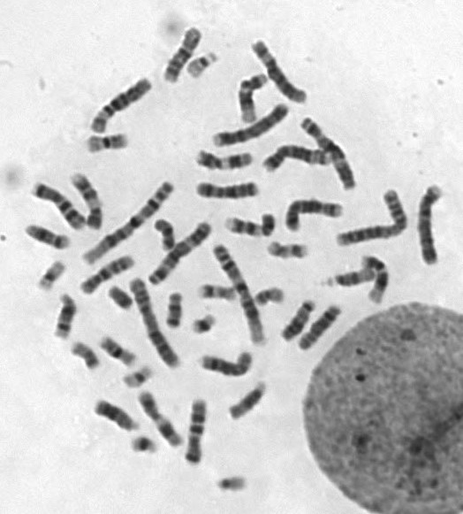
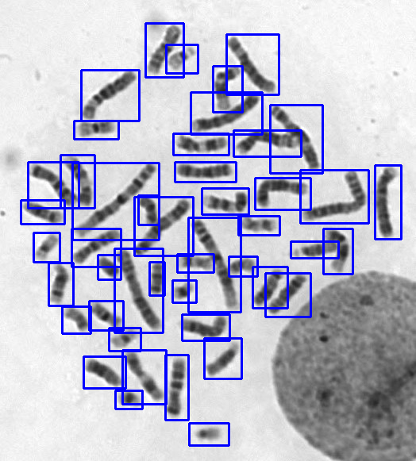
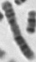
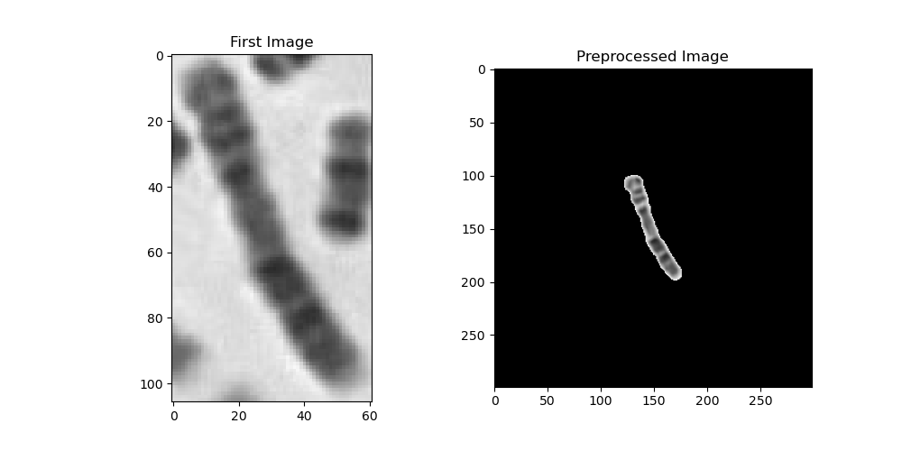
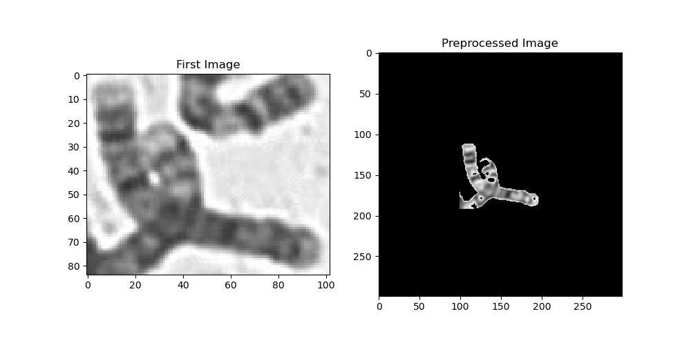
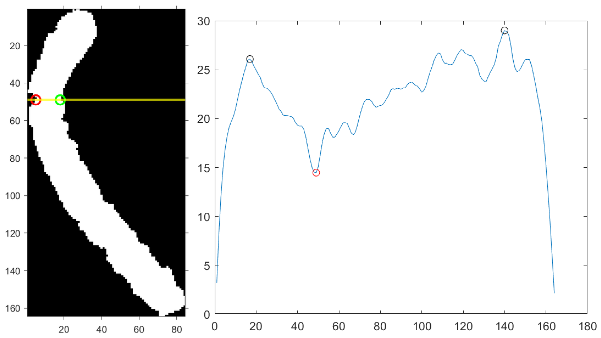
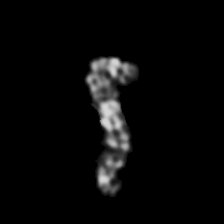
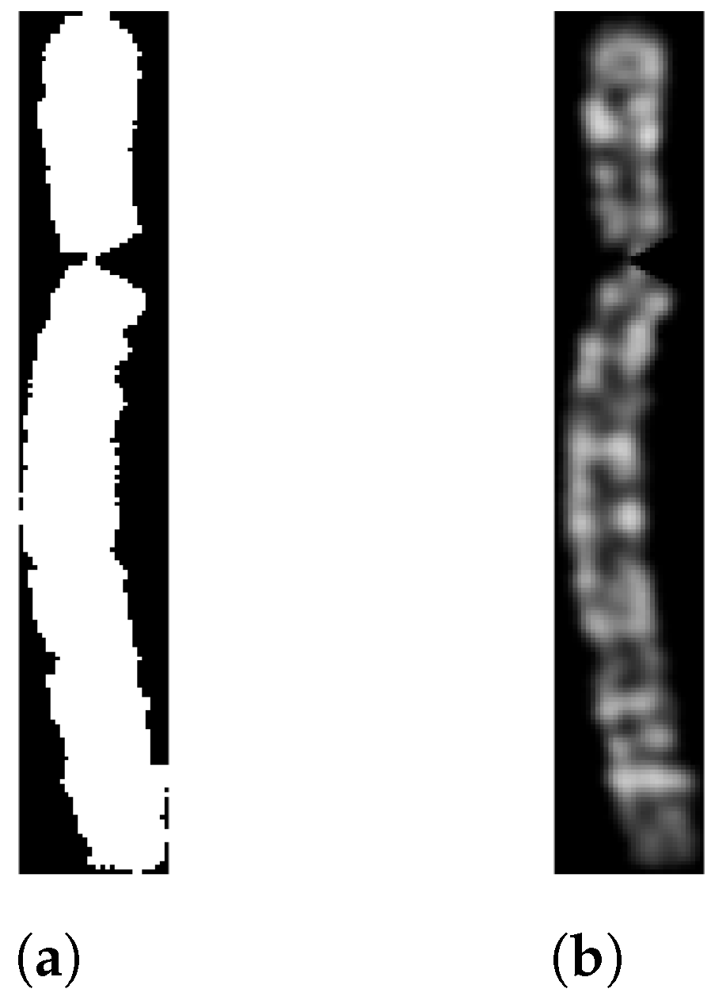

# Chromosomes Recognition 🧬


> **Goal:** Integrate deep learning into genome analysis software, replacing legacy image-similarity systems (≈70% accuracy) with reliable automation (>96% accuracy under reproducible conditions).

---

## ⚡ TL;DR

- **Task:** Human chromosome classification (24 classes: 1–22, X, Y).
- **Reality:** Chromosome recognition *in the wild* is extremely hard due to overlap, folding, and noise.
- **Approach:** Decompose the problem and validate the **core recognition module** on a controlled but non-trivial public dataset.
- **Outcome:** **ResNet18** selected as the best engineering trade-off (accuracy, speed, model size).
- **Stack:** PyTorch · OpenCV · Flask.

---

## 🧪 Chromosome Recognition: In the Wild vs Public Setting

Chromosome recognition in real laboratory conditions is substantially more challenging than typical benchmark tasks. This project explicitly distinguishes between these two scenarios.

---

### 🧬 In-the-Wild Karyotypes (Real Acquisition)

Real microscopy images contain **all chromosomes in a single frame**, together with multiple sources of complexity:

- severe **overlap between chromosomes**
- **folded and bent** structures
- background artifacts and uneven illumination
- partial occlusions and low signal-to-noise ratio

<p align="center">
  
</p>

The same image annotated with **bounding boxes** highlights the complexity of instance separation in dense karyotypes:

<p align="center">
  
</p>

Even with annotation-based cropping and classical preprocessing, the extracted samples can remain ambiguous:

<p align="center">
  
</p>

Annotation-based cropping and connected-components filtering can work well **when chromosomes are sufficiently separated**, producing clean single-instance masks:

<p align="center">
  
</p>

However, when **overlap occurs**, classical heuristics can break down and generate unusable artifacts (e.g., merged instances, missing parts, fragmented masks):

<p align="center">
  
</p>

In these conditions, **pure classification is unreliable** unless preceded by robust segmentation, overlap resolution, and geometric normalization.

---

### 🧪 Public & Reproducible Setting (This Repository)

The public version of this project focuses on a **controlled but non-trivial setting**, chosen to isolate and validate the recognition component itself.

Characteristics:

- isolated single-chromosome images
- no overlap between instances
- realistic shape variability and banding patterns preserved

<p align="center">
  
</p>

This setting enables:

- fair and reproducible evaluation
- meaningful architectural comparison
- clear attribution of errors to the classifier (not segmentation noise)

Importantly, this is **not a simplification of the task**, but a necessary decomposition of a much harder real-world pipeline.

---

### 🔒 About Private Pipelines


Handling fully unconstrained karyotypes requires substantially more complex processing stages than those released publicly.


In particular, the private pipeline explored:


- **instance-level chromosome segmentation** in dense karyotypes
- **overlap-aware processing** for partially occluded chromosomes
- **chromosome straightening** via centromere detection and curvature analysis


<p align="center">

</p>


The first step identifies the **centromere region** by analyzing local curvature and width variations along the chromosome skeleton.


<p align="center">

</p>


The chromosome is often **folded or bent** around the centromere, which introduces strong geometric variability that negatively impacts direct classification.


<p align="center">

</p>


By estimating the main bending point and reparameterizing the chromosome axis, folded chromosomes are transformed into a **canonical, vertically aligned representation**. This geometric normalization allows downstream models to focus on **banding patterns and morphology rather than orientation or curvature**.


These stages rely on **more complex models and training strategies**, developed on significantly harder data distributions (dense, noisy, and highly variable karyotypes). Due to the use of proprietary data and contractual constraints, this pipeline is **not included in the public release**.


The objective of this repository is therefore to expose a **clean, reproducible benchmark** for the chromosome recognition component, which can be integrated into larger, production-grade systems.


---

## 🛠 Pipeline Overview

### Preprocessing

All public-setting images undergo the following steps:

1. **Padding & resizing** to match CNN input size (224×224 or 299×299).
2. **Data augmentation** (random):
   - rotation, translation, scaling
   - brightness / contrast / saturation variation
   - Gaussian blur (σ ∈ [0.1, 5])

This compensates for limited data availability and simulates microscope variability.

---

## 🧠 Models & Training

### Experimental Setup

- Optimizers: Adam, SGD, RMSprop
- Learning rates: 1e−4, 1e−3, 1e−2
- Batch size: 16
- Weight decay: 1e−5
- LR scheduler: ×0.1 every 30 epochs
- Early stopping: patience = 10 epochs

### Model Comparison

| Model | Val. Accuracy | Parameters | Notes |
|------:|:-------------:|-----------:|-------|
| **ResNet50** | **99.0%** | ~25M | Highest accuracy, signs of overfitting. |
| **ResNet18** | **96.2%** | **~11M** | 🏆 Best speed/size/accuracy trade-off. |
| VGG16 | 96.8% | ~138M | Too heavy for integration. |
| InceptionV3 | 96.0% | ~23M | Solid but slower. |

**Final choice:** ResNet18, prioritizing deployability and robustness over marginal accuracy gains.

---


## 📦 Requirements


> The original environment is no longer available. Below is a **minimal, conservative dependency set** that is sufficient to run the code paths exposed in this repository (training, inference, Flask demo).


Create a `requirements.txt` with:


```txt
python>=3.8
numpy>=1.21
opencv-python>=4.6
pillow>=9.0
scikit-learn>=1.1
matplotlib>=3.6


# Deep Learning
torch>=1.12
torchvision>=0.13


# API
flask>=2.2
```


> Notes:
> - Versions are intentionally permissive to avoid lock-in.
> - CUDA builds of PyTorch should be installed according to your GPU/OS.
> - This list reflects **functional dependencies**, not a frozen experiment snapshot.


---


## 🚀 Installation


```bash
git clone https://github.com/Pampaj7/ChromosomesRecognition.git
cd ChromosomesRecognition


python -m venv venv
source venv/bin/activate # Windows: venv\\Scripts\\activate


pip install -r requirements.txt
```


---


## 🏋️ Training


```bash
python src/train.py \
--data data/dataset2 \
--model resnet18 \
--epochs 60 \
--batch-size 16 \
--lr 1e-4 \
--optimizer adam \
--weight-decay 1e-5 \
--early-stop 10
```


---


## 🔍 Inference


```bash
python src/infer.py \
--checkpoint checkpoints/best_resnet18.pt \
--image path/to/chromosome.tiff
```


---


## 🌐 Flask API (Demo)


A minimal Flask application demonstrates integration into external software.


```bash
python api/app.py
```


---


## ⚠ Limitations


- Fully unconstrained karyotypes remain challenging without segmentation and straightening.
- Some irregular chromosome morphologies are inherently ambiguous.
- Reported accuracy reflects **reproducible, controlled conditions**.


---


## 🔮 Future Work


- Centromere-based chromosome straightening
- Instance segmentation for raw karyotypes
- Overlap resolution via reconstruction or inpainting


---


## 👥 Authors


- Leonardo Pampaloni
- Matteo Tinacci


---


## 📚 References


- D’Angelo, L., Nanni, L. *Deep-Learning-Based Human Chromosome Classification: Data Augmentation and Ensemble*.
- Lin et al., chromosome dataset repository.


> A detailed technical report is available in `docs/`.